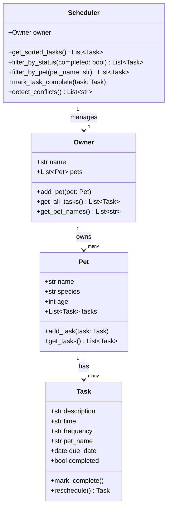

```mermaid
classDiagram
    class Task {
        +str description
        +str time
        +str frequency
        +str pet_name
        +date due_date
        +bool completed
        +mark_complete()
        +reschedule() Task
    }

    class Pet {
        +str name
        +str species
        +int age
        +List~Task~ tasks
        +add_task(task: Task)
        +get_tasks() List~Task~
    }

    class Owner {
        +str name
        +List~Pet~ pets
        +add_pet(pet: Pet)
        +get_all_tasks() List~Task~
        +get_pet_names() List~str~
    }

    class Scheduler {
        +Owner owner
        +get_sorted_tasks() List~Task~
        +filter_by_status(completed: bool) List~Task~
        +filter_by_pet(pet_name: str) List~Task~
        +mark_task_complete(task: Task)
        +detect_conflicts() List~str~
    }

    Owner "1" --> "many" Pet : owns
    Pet "1" --> "many" Task : has
    Scheduler "1" --> "1" Owner : manages
```